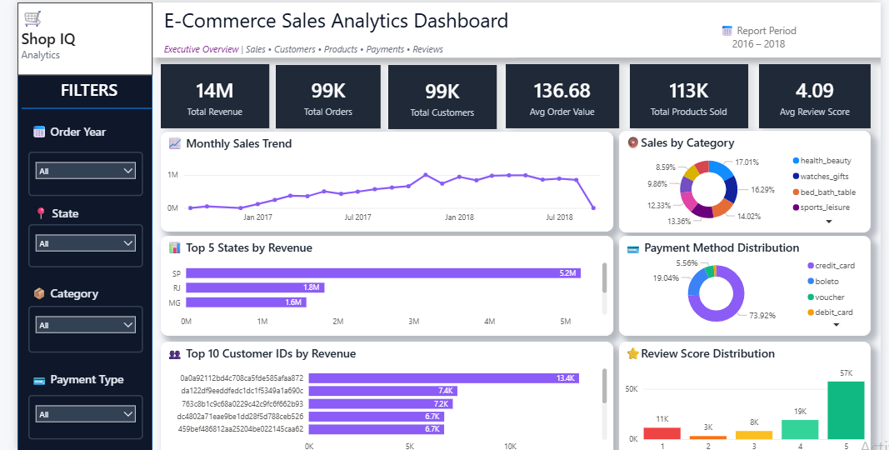
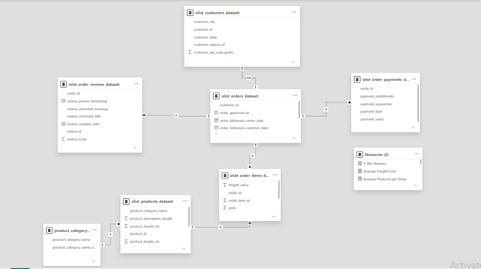

# 🛒 E-Commerce Sales Analytics Dashboard | Power BI

<p align="center">


</p>

<p align="center">
A professional Power BI portfolio project demonstrating end-to-end Business Intelligence, Data Modeling, DAX calculations, and interactive dashboard development.
</p>

<p align="center">

<a href="https://github.com/unnatinavlani-ui/ECommerce-Sales-Analytics-Dashboard-PowerBI">

</a>

</p>

---

# 📊 Dashboard Preview

<p align="center">

</p>

> 📌 Interactive executive dashboard designed to monitor revenue, customer behaviour, product performance, payment methods, and customer satisfaction.

---

## ✨ Project Highlights

✔ Executive Dashboard Design

✔ Interactive KPI Cards

✔ Dynamic DAX Measures

✔ Professional Dashboard Layout

✔ Interactive Filters & Slicers

✔ Star Schema Data Model

✔ Business Insights

✔ Portfolio Ready Project

---

## 📑 Table of Contents

- [📌 Project Overview](#-project-overview)
- [🎯 Business Objectives](#-business-objectives)
- [📈 Dashboard Features](#-dashboard-features)
- [🗂️ Data Model](#-data-model)
- [🛠️ Tools & Technologies](#-tools--technologies)
- [📂 Dataset](#-dataset)
- [🧠 Skills Demonstrated](#-skills-demonstrated)
- [💡 Key Business Insights](#-key-business-insights)
- [📁 Repository Structure](#-repository-structure)
- [📦 Repository Contents](#-repository-contents)
- [⭐ Project Information](#-project-information)
- [🚀 Future Enhancements](#-future-enhancements)
- [👩‍💻 Author](#-author)

---

# 📌 Project Overview

This project presents an interactive **E-Commerce Sales Analytics Dashboard** built using **Power BI**. It transforms raw e-commerce data into meaningful business insights through **Power Query**, **Data Modeling**, **DAX calculations**, and interactive visualizations.

The dashboard enables decision-makers to:

- Monitor overall sales performance
- Track monthly sales trends
- Analyze product category performance
- Understand customer purchasing behaviour
- Evaluate payment preferences
- Identify top-performing states and customers
- Measure customer satisfaction using review scores

---

# 🎯 Business Objectives

This dashboard was built to answer key business questions such as:

- Monitor overall sales performance
- Track monthly sales trends
- Analyze product category contribution
- Understand customer purchasing behaviour
- Identify top-performing customers
- Analyze sales by state
- Evaluate payment method distribution
- Measure customer satisfaction
- Support data-driven business decisions

---

# 📈 Dashboard Features

## 📊 Executive KPIs

- 💰 Total Revenue
- 📦 Total Orders
- 👥 Total Customers
- 💳 Average Order Value
- 📦 Total Products Sold
- ⭐ Average Review Score

---

## 📈 Interactive Visualizations

- 📈 Monthly Sales Trend
- 🍩 Sales by Product Category
- 📍 Top States by Revenue
- 💳 Payment Method Distribution
- 👥 Top Customers by Revenue
- ⭐ Review Score Distribution

---

## 🎛 Interactive Filters

- 📅 Order Year
- 📍 Customer State
- 📦 Product Category
- 💳 Payment Type

---

# 🗂️ Data Model

The dashboard follows a **Star Schema** data model, ensuring efficient relationships and optimized report performance.

The model integrates multiple tables to provide a complete view of the e-commerce business, including customers, orders, products, payments, and reviews.

<p align="center">

</p>

---

# 🛠️ Tools & Technologies

| Category | Technology |
|----------|------------|
| 📊 Data Visualization | Power BI Desktop |
| 🔄 Data Transformation | Power Query |
| 🧮 Data Analysis | DAX (Data Analysis Expressions) |
| 🗂️ Data Modeling | Star Schema |
| 📈 Dashboard Design | Interactive Visualizations |
| 💻 Version Control | Git & GitHub |

---

# 📂 Dataset

This project uses the **Brazilian Olist E-Commerce Dataset**, one of the most widely used public datasets for learning Business Intelligence and Data Analytics.

### Dataset Tables

- 👥 Customers
- 📦 Orders
- 🛒 Order Items
- 📦 Products
- 💳 Payments
- ⭐ Reviews
- 🌐 Product Category Translation

📁 All dataset files are available inside the **Dataset** folder of this repository.

---

# 📥 Download Dashboard

You can download and explore the complete Power BI dashboard from this repository.

📄 **Dashboard File**

- `ECommerce_Sales_Analytics_Dashboard.pbix`

> Open the file using **Power BI Desktop** to interact with all visuals, filters, and DAX measures.

---

# 🧠 Skills Demonstrated

Through this project, the following skills were applied:

### 📊 Business Intelligence

- KPI Development
- Dashboard Design
- Business Reporting

### 📈 Data Analytics

- Sales Analysis
- Customer Analysis
- Payment Analysis
- Review Analysis

### ⚙ Technical Skills

- Power Query
- DAX Calculations
- Data Modeling
- Interactive Filters
- Data Visualization

---

# 💡 Key Business Insights

✔ Monthly sales trends help identify seasonal demand.

✔ Product category analysis highlights the highest revenue-generating categories.

✔ Payment method distribution provides insights into customer purchasing preferences.

✔ Customer review scores indicate overall customer satisfaction.

✔ State-wise revenue analysis identifies the strongest regional markets.

✔ Top customer analysis helps businesses identify high-value customers for retention strategies.

✔ Interactive slicers allow users to explore the dashboard dynamically.

---

# 📊 Dashboard Capabilities

The dashboard enables users to:

- Monitor business performance in real time
- Compare sales across categories
- Identify top-performing regions
- Analyze customer purchasing behaviour
- Evaluate customer satisfaction
- Explore payment preferences
- Filter reports dynamically for deeper insights

---

# 📁 Repository Structure

```text
ECommerce-Sales-Analytics-Dashboard-PowerBI
│
├── 📁 Dashboard_Screenshots
│   ├── Dashboard_Preview.png
│   └── Data_Model.png
│
├── 📁 Dataset
│   ├── olist_customers_dataset.csv
│   ├── olist_orders_dataset.csv
│   ├── olist_order_items_dataset.csv
│   ├── olist_products_dataset.csv
│   ├── olist_order_payments_dataset.csv
│   ├── olist_order_reviews_dataset.csv
│   └── product_category_name_translation.csv
│
├── 📄 ECommerce_Sales_Analytics_Dashboard.pbix
└── 📄 README.md
```

---

# 📦 Repository Contents

This repository includes everything required to understand, explore, and reproduce the dashboard.

| Resource | Description |
|----------|-------------|
| 📊 Power BI Dashboard | Interactive Power BI dashboard (.pbix) |
| 📂 Dataset | Complete CSV files used for analysis |
| 📸 Dashboard Screenshots | Dashboard preview and data model |
| 🗂️ Data Model | Star Schema relationship model |
| 📘 Documentation | Complete project documentation |

---

# ⭐ Project Information

| Category | Details |
|----------|---------|
| Project | E-Commerce Sales Analytics Dashboard |
| Tool | Power BI Desktop |
| Data Transformation | Power Query |
| Language | DAX |
| Data Modeling | Star Schema |
| Dataset | Brazilian Olist E-Commerce Dataset |
| Dashboard Type | Executive Sales Dashboard |
| Dashboard Pages | 1 |
| Interactive Filters | Order Year, Customer State, Product Category, Payment Type |
| Project Type | Portfolio Project |

---

# 🚀 Future Enhancements

Planned improvements for future versions:

- 📈 Sales Forecasting
- 💰 Profit Analysis Dashboard
- 👥 Customer Segmentation
- 📦 Inventory Performance Analysis
- 🌍 Geographic Sales Map
- 📊 Drill-through Report Pages
- 💡 Advanced Tooltips
- 🤖 AI-powered Business Insights

---

# 📚 Learning Outcomes

This project helped strengthen practical skills in:

- Building interactive Power BI dashboards
- Writing efficient DAX measures
- Data cleaning using Power Query
- Designing Star Schema data models
- Creating business-focused KPIs
- Storytelling with data visualization
- Building recruiter-ready portfolio projects

---

# 🙌 Acknowledgements

This project is based on the publicly available **Brazilian Olist E-Commerce Dataset**, which is widely used for learning Business Intelligence and Data Analytics.

Special thanks to the Power BI community and Microsoft documentation for learning resources and best practices.

---

# 👩‍💻 Author

## Unnati Navlani

**Aspiring Data Analyst** passionate about transforming raw data into meaningful business insights through **Power BI, SQL, Excel, and Data Visualization**.

### Connect with Me

- 🌐 GitHub: https://github.com/unnatinavlani-ui

- 🌐 Linkedin: https://www.linkedin.com/in/unnatinavlani/

---

# ⭐ Support

If you found this project useful or learned something from it, please consider giving this repository a ⭐.

Your support motivates me to build more data analytics projects.

---

<p align="center">

### ⭐ Thank you for visiting this repository! ⭐

Made with ❤️ using Power BI

</p>
